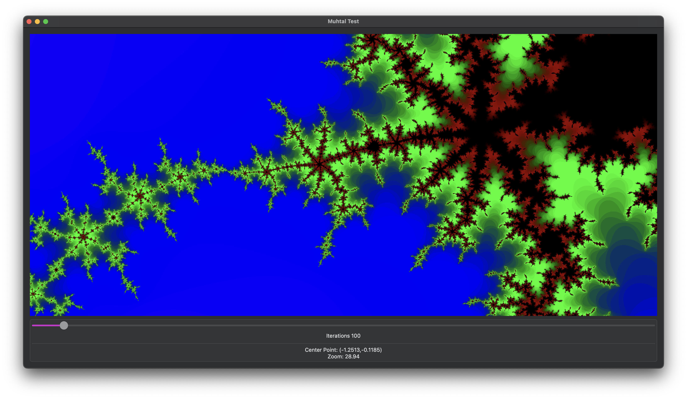

# Metal SwiftUI Test using a Mandelbrot Set

A very basic project to test using Metal shaders with SwiftUI. This displays a scrollable and zoomable mandelbrot set which is rendered as a shader.

## Details

The main work on generating the Mandelbrot is done in Meta/shaders.metal. This takes in a simple structure giving where in the Mandelbrot should be rendered. The colors are sampled from a provided texture which is just a 1D color map.

The shader is essentially doing the calculation:
$$z_{n+1} = z_n^2 + c$$
where $z_0 = 0$ and $c$ is the point in the Mandelbrot set we're looking at.

The number of iterations is set from a range of 10 to 2000, and the color is determined by the number of iterations it takes to escape the set.

To add this to SwiftUI, a _NSViewRepresentable_ struct is used to create a _MetalView_ which then handles connecting to the metal engine, rendering it to the view, as well as handling the zooming interaction. This view is then added to the SwiftUI view hierarchy, which handles dragging around the set.

Finally there's a slider to handle the number of iterations, which is passed to the shader.

## Known Issues

The biggest issue is you can only zoom a limited amount before we hit the precision limit of the number system used in the shader. This requires rewriting the shader to use a different number system which is an interesting problem - particularly to do so in a way that's efficient.

This also urgently needs some comments added to the code.
